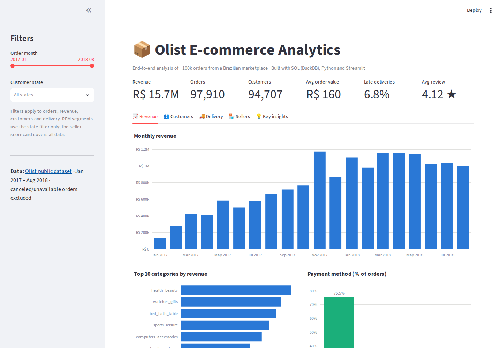
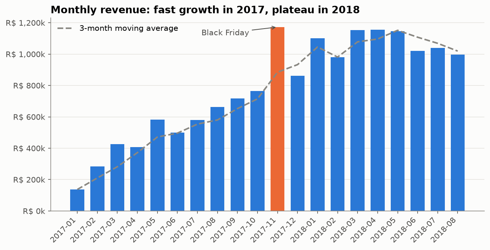
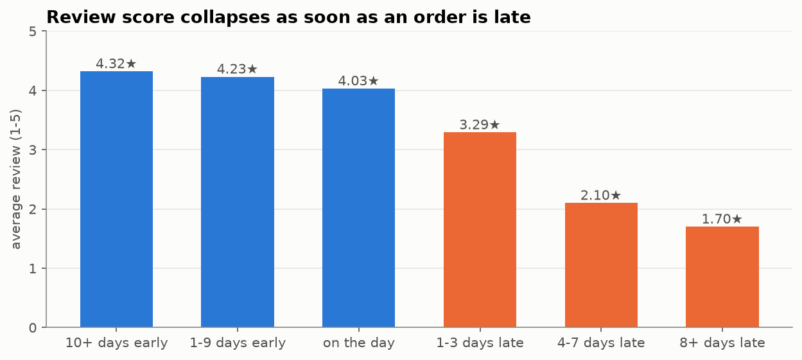
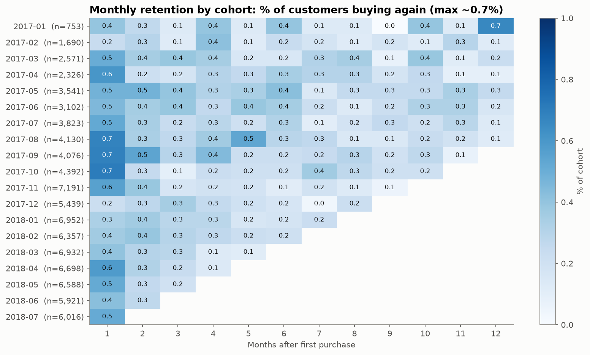
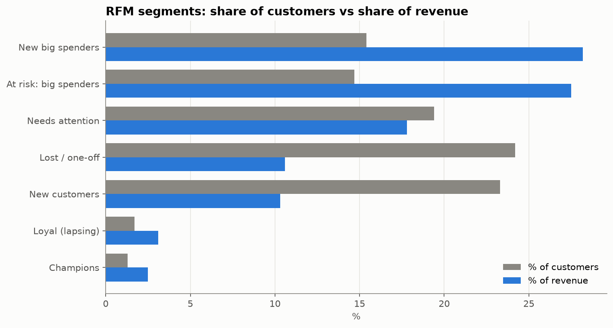
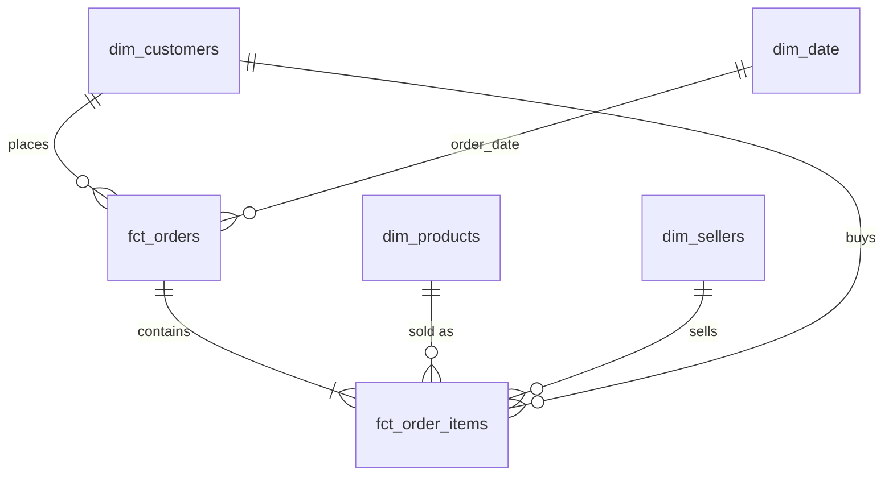

# Olist E-commerce Analytics: Growth, Retention & Delivery

**End-to-end analytics project on ~100k real orders from Olist, a Brazilian e-commerce marketplace (2016–2018).**
Raw CSVs → tested SQL data model → statistical analysis → interactive dashboard → business recommendations.

**▶ Live dashboard: [olist-analytics-adhiraj.streamlit.app](https://olist-analytics-adhiraj.streamlit.app/)**



`Python` · `SQL (DuckDB)` · `pandas` · `SciPy` · `Matplotlib` · `Plotly` · `Streamlit` · `Git`

---

## The business problem
Olist's leadership wants to know: **Is revenue still growing? Do customers come back? Is delivery hurting the business? Which sellers need attention?**
This project answers those questions with SQL, statistics and a dashboard, and ends with concrete recommendations.

## Key findings

| # | Finding | Evidence |
|---|---|---|
| 1 | **Growth has stalled.** Jan–Aug revenue grew **+140% YoY**, but monthly revenue has been flat at ~R$ 1.0–1.15M throughout 2018 | [Revenue analysis](notebooks/03_revenue_analysis.ipynb) |
| 2 | **Growth came from volume only.** Orders grew ~8× while average order value stayed at ~R$ 160 | [Revenue analysis](notebooks/03_revenue_analysis.ipynb) |
| 3 | **Almost no one returns.** ~97% of customers order once; ~30% of "repeat" orders are same-day split baskets, so the **true repeat rate is ≈ 2%** | [Customer analysis](notebooks/04_customer_analysis.ipynb) |
| 4 | **Two RFM segments are ~30% of customers but ~56% of revenue** ("new" and "at-risk" big spenders) | [Customer analysis](notebooks/04_customer_analysis.ipynb) |
| 5 | **Late deliveries destroy satisfaction: 2.3★ vs 4.3★** on time (Welch t-test p≈0, Cohen's d = 1.47) | [Delivery analysis](notebooks/05_delivery_seller_analysis.ipynb) |
| 6 | **A late first delivery cuts the repeat rate by ~19%** (chi-square p≈0.01) | [Delivery analysis](notebooks/05_delivery_seller_analysis.ipynb) |
| 7 | **The carrier leg is ~75% of delivery time**; late rates spiked to 12–19% after demand peaks | [Delivery analysis](notebooks/05_delivery_seller_analysis.ipynb) |
| 8 | **Top 10% of sellers = ~2/3 of revenue**; 50 established sellers underperform, including the #2 seller by revenue | [Seller scorecard](notebooks/05_delivery_seller_analysis.ipynb) |

<p align="center">
  
  
</p>
<p align="center">
  
  
</p>

## Recommendations
1. **Protect the delivery promise.** Plan carrier capacity ahead of demand peaks (Black Friday, post-holiday) and fix routes to the North-East and Rio de Janeiro (12% late). Estimates are padded by ~12 days; tightening them could lift conversion.
2. **Lift average order value.** Growth so far came only from more orders. Promote interest-free installments (7+ installment orders have ~3× AOV), bundles and free-shipping thresholds.
3. **Target retention where it pays.** Run a win-back campaign for the ~14k *at-risk big spenders*, time post-purchase journeys at 60–90 days (median repeat gap: 75 days), and focus on home & fashion buyers, who repeat 2–3× more.
4. **Hold sellers to an SLA.** Introduce a handling-time target (handling time correlates with lateness, ρ = 0.36) and improvement plans for the 50 underperforming sellers.

📄 One-page summary for stakeholders: [reports/executive_summary.md](reports/executive_summary.md)

---

## How it's built

```
Kaggle CSVs (9 tables, ~1.4M rows)
   │  src/load_data.py
   ▼
DuckDB · raw          untouched source data
   │  src/build_models.py  (sql/staging → sql/marts → sql/tests)
   ▼
DuckDB · staging      renamed, typed, de-duplicated, translated
   ▼
DuckDB · marts        star schema + customer RFM + seller scorecard   ✔ 12 automated data tests
   │                              │
   ▼                              ▼  src/export_dashboard_data.py
notebooks/ (analysis)       dashboard/data/*.parquet → Streamlit app (deployed)
```

### Data model (star schema)

| Table | Grain | Rows |
|---|---|---:|
| `fct_orders` | one order | 99,441 |
| `fct_order_items` | one item in an order | 112,650 |
| `dim_customers` | one real customer (`customer_unique_id`) | 96,096 |
| `dim_products` | one product | 32,951 |
| `dim_sellers` | one seller | 3,095 |
| `dim_date` | one calendar day | 791 |
| `customer_rfm` | one customer with RFM scores & segment | 94,707 |
| `seller_scorecard` | one seller with KPIs & performance flag | 3,029 |

### Data quality
Profiling found 8 issues, each documented and handled in the staging layer ([full report](reports/data_quality_report.md)). The most important:
- `customer_id` is generated **per order**; using it would show 0% repeat customers, so real customers are identified by `customer_unique_id`.
- Duplicate reviews per order were de-duplicated with `ROW_NUMBER()`.
- Incomplete edge months were excluded, so trends use Jan 2017 – Aug 2018.
- Joining items and payments directly would inflate revenue (fan-out), so both are aggregated to order grain first, and a reconciliation test guards it.

### Analysis notebooks
| Notebook | Covers |
|---|---|
| [01 · Data profiling](notebooks/01_data_profiling.ipynb) | data quality checks, issues and decisions |
| [02 · Data modeling](notebooks/02_data_modeling.ipynb) | layered model, star schema, joins, fan-out |
| [03 · Revenue & growth](notebooks/03_revenue_analysis.ipynb) | trends, MoM/YoY growth (window functions), Black Friday, categories, payments |
| [04 · Customers](notebooks/04_customer_analysis.ipynb) | repeat rate, cohort retention, RFM segmentation |
| [05 · Delivery & sellers](notebooks/05_delivery_seller_analysis.ipynb) | delivery stages, hypothesis tests, seller scorecard |

---

## Run it yourself
```bash
git clone https://github.com/adhirajsinha1/olist-analytics.git
cd olist-analytics
python3 -m venv .venv && source .venv/bin/activate
pip install -r requirements.txt
```
1. Download the [Olist dataset from Kaggle](https://www.kaggle.com/datasets/olistbr/brazilian-ecommerce) and unzip the CSVs into `data/raw/`
2. `python src/load_data.py`: load CSVs into DuckDB
3. `python src/build_models.py`: build staging + marts and run the data tests
4. `python src/export_dashboard_data.py`: export Parquet files for the dashboard
5. `python -m streamlit run dashboard/app.py`: run the dashboard locally
6. Open the notebooks in `notebooks/` in order

## Project structure
```
data/raw/         source CSVs (not committed, download from Kaggle)
sql/staging/      cleaning models (one file per table)
sql/marts/        star schema, RFM and seller scorecard models
sql/tests/        data quality tests
src/              pipeline scripts + shared chart style
notebooks/        analysis notebooks
reports/          data quality report, executive summary, charts
dashboard/        Streamlit app + its Parquet data
```

## Author
**Adhiraj Sinha**, undergraduate student at VIT Chennai (2023–2027), interested in data & business analytics.
[GitHub](https://github.com/adhirajsinha1)

*Data: Olist Brazilian E-Commerce Public Dataset (CC BY-NC-SA 4.0), used for educational purposes.*
