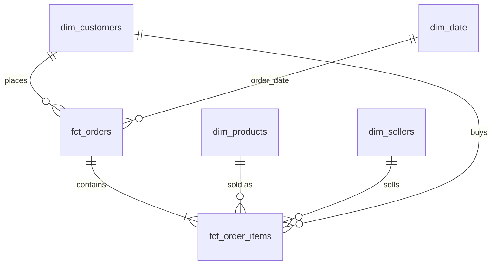

# Olist E-commerce Analytics

> 🚧 Work in progress: this README gets finished on Day 7 with findings, charts and a dashboard link.

End-to-end analysis of **~100k real orders** from Olist, a Brazilian e-commerce marketplace (2016–2018).
The project covers revenue growth, customer retention, delivery performance and seller quality, and ends with business recommendations.

## Business questions
1. How is revenue growing, and what drives it (categories, regions, seasonality)?
2. Do customers come back? Which customer segments matter most?
3. How reliable is delivery, and how does lateness affect customer satisfaction?
4. Which sellers perform well or badly?
5. How do customers pay, and does that relate to order value?

## Tech stack
Python (pandas) · SQL (DuckDB) · Jupyter · Plotly / Matplotlib · Streamlit · Git & GitHub

## Pipeline
```
Kaggle CSVs → src/load_data.py → DuckDB raw
            → src/build_models.py → staging → marts (star schema) → data tests
            → analysis notebooks → Streamlit dashboard
```

## Data model (star schema)

| Table | Grain | Rows |
|---|---|---:|
| `fct_orders` | one order | 99,441 |
| `fct_order_items` | one item in an order | 112,650 |
| `dim_customers` | one real customer (`customer_unique_id`) | 96,096 |
| `dim_products` | one product | 32,951 |
| `dim_sellers` | one seller | 3,095 |
| `dim_date` | one calendar day | 791 |

**Layers:** `raw` (untouched CSVs) → `staging` (cleaned, de-duplicated, translated) → `marts` (star schema).
**Data tests:** 10 SQL tests (uniqueness, no lost rows, revenue reconciliation, valid ranges, non-null keys) run on every build.

## Project structure
```
data/raw/        source CSVs (not committed, see "How to run")
src/             Python scripts (data loading, pipeline)
sql/staging/     cleaning models (one file per table)
sql/marts/       star schema models
sql/tests/       data quality tests
notebooks/       analysis notebooks
reports/         written findings (data quality report, insights)
```

## How to run
1. Download the [Olist dataset from Kaggle](https://www.kaggle.com/datasets/olistbr/brazilian-ecommerce) and unzip the CSVs into `data/raw/`
2. `python3 -m venv .venv && source .venv/bin/activate`
3. `pip install -r requirements.txt`
4. `python src/load_data.py`: loads CSVs into DuckDB
5. `python src/build_models.py`: builds staging + star schema and runs 10 data tests
6. Open the notebooks in `notebooks/` in order

## Progress
- [x] Day 1: data loading and data quality profiling ([report](reports/data_quality_report.md))
- [x] Day 2: cleaning, star schema and automated data tests
- [ ] Day 3: revenue and payments analysis
- [ ] Day 4: cohort retention and RFM segmentation
- [ ] Day 5: delivery and seller performance
- [ ] Day 6: dashboard
- [ ] Day 7: final insights and recommendations
