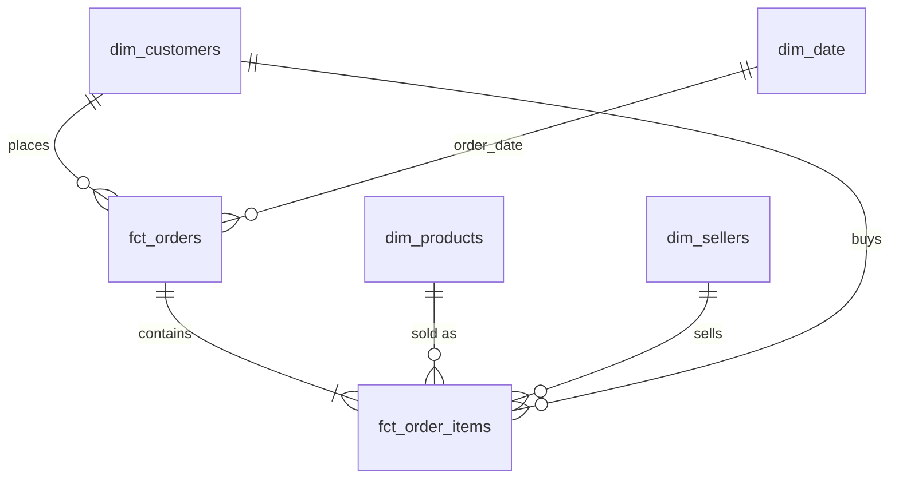

# Olist E-commerce Analytics

> 🚧 Work in progress: this README gets finished on Day 7 with findings, charts and a dashboard link.

End-to-end analysis of **~100k real orders** from Olist, a Brazilian e-commerce marketplace (2016–2018).
The project covers revenue growth, customer retention, delivery performance and seller quality, and ends with business recommendations.

## Key findings so far


- **R$ 15.7M revenue** from ~98k orders (Jan 2017 – Aug 2018); Jan–Aug revenue **+140% year over year**
- **Growth has stalled:** monthly revenue has been flat at ~R$ 1.0–1.15M throughout 2018
- Order volume grew ~8× while **average order value stayed flat (~R$ 160)**, so growth came from volume only
- **Black Friday 2017 = 7.5× a normal day's orders**
- Credit card pays for ~75% of orders; **orders split into 7+ installments have ~3× the average order value**
- **Only ~3% of customers order again, and ~30% of those "repeats" are same-day split baskets → true repeat rate ≈ 2%**
- Retention is **under 1% per month in every cohort**; genuine repeat buyers return after a median of 75 days
- RFM segmentation: **"new" and "at-risk" big spenders are ~30% of customers but ~56% of revenue**
- **6.8% of deliveries are late, and late orders average 2.3★ vs 4.3★ on time** (Welch t-test p≈0, Cohen's d = 1.47)
- **A late first delivery cuts the repeat rate by ~19%** (chi-square p≈0.01)
- The **carrier leg is ~75% of delivery time**; late rates spiked to 12–19% after demand peaks
- Top 10% of sellers = ~2/3 of revenue; **50 established sellers underperform**, including the #2 seller by revenue

## Business questions
1. How is revenue growing, and what drives it (categories, regions, seasonality)?
2. Do customers come back? Which customer segments matter most?
3. How reliable is delivery, and how does lateness affect customer satisfaction?
4. Which sellers perform well or badly?
5. How do customers pay, and does that relate to order value?

## Tech stack
Python (pandas) · SQL (DuckDB) · Jupyter · Plotly / Matplotlib · Streamlit · Git & GitHub

## Pipeline
```
Kaggle CSVs → src/load_data.py → DuckDB raw
            → src/build_models.py → staging → marts (star schema) → data tests
            → analysis notebooks → Streamlit dashboard
```

## Data model (star schema)

| Table | Grain | Rows |
|---|---|---:|
| `fct_orders` | one order | 99,441 |
| `fct_order_items` | one item in an order | 112,650 |
| `dim_customers` | one real customer (`customer_unique_id`) | 96,096 |
| `dim_products` | one product | 32,951 |
| `dim_sellers` | one seller | 3,095 |
| `dim_date` | one calendar day | 791 |
| `customer_rfm` | one customer with RFM scores & segment | 94,707 |
| `seller_scorecard` | one seller with KPIs & performance flag | 3,029 |

**Layers:** `raw` (untouched CSVs) → `staging` (cleaned, de-duplicated, translated) → `marts` (star schema).
**Data tests:** 12 SQL tests (uniqueness, no lost rows, revenue reconciliation, valid ranges, non-null keys) run on every build.

## Project structure
```
data/raw/        source CSVs (not committed, see "How to run")
src/             Python scripts (data loading, pipeline)
sql/staging/     cleaning models (one file per table)
sql/marts/       star schema models
sql/tests/       data quality tests
notebooks/       analysis notebooks
reports/         written findings (data quality report, insights)
```

## How to run
1. Download the [Olist dataset from Kaggle](https://www.kaggle.com/datasets/olistbr/brazilian-ecommerce) and unzip the CSVs into `data/raw/`
2. `python3 -m venv .venv && source .venv/bin/activate`
3. `pip install -r requirements.txt`
4. `python src/load_data.py`: loads CSVs into DuckDB
5. `python src/build_models.py`: builds staging + star schema and runs 12 data tests
6. Open the notebooks in `notebooks/` in order

## Progress
- [x] Day 1: data loading and data quality profiling ([report](reports/data_quality_report.md))
- [x] Day 2: cleaning, star schema and automated data tests
- [x] Day 3: revenue, growth and payments analysis ([notebook](notebooks/03_revenue_analysis.ipynb))
- [x] Day 4: cohort retention and RFM segmentation ([notebook](notebooks/04_customer_analysis.ipynb))
- [x] Day 5: delivery, seller scorecard and statistical tests ([notebook](notebooks/05_delivery_seller_analysis.ipynb))
- [ ] Day 6: dashboard
- [ ] Day 7: final insights and recommendations
